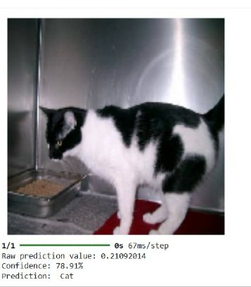
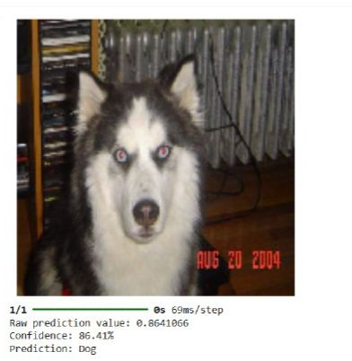

# Cats-Dogs Image Classification

This project uses a deep learning model to classify images of cats and dogs. It leverages transfer learning with the MobileNetV2 architecture, built using TensorFlow and Keras.

---

## Model Predictions
Here are some examples of the model predicting on new images.

| Cat Prediction | Dog Prediction |
| :---: | :---: |
|  |  |


---

## Training Performance
The model's performance during training is shown below, plotting accuracy and loss for both the training and validation sets.


---

## How to Use
1.  **Get the code**:
    Download the files from this repository.

2.  **Install dependencies**:
    Install the necessary libraries using the `requirements.txt` file.
    ```bash
    pip install -r requirements.txt
    ```
    
3.  **Run the notebook**:
    Open and run the `project (1).ipynb` notebook in a Jupyter environment. The notebook will automatically download the required dataset.

---

## Project Files
* **project (1).ipynb**: The main Jupyter Notebook with all the code for training and evaluation.
* **final_image_classifier.keras**: The final trained and saved model.
* **requirements.txt**: A list of Python libraries needed to run the project.
* **training_curve.jpg**: Visual results of the training curves.
* **cat_prediction.jpg & dog_prediction.jpg**: Example images showing the model's predictions.
